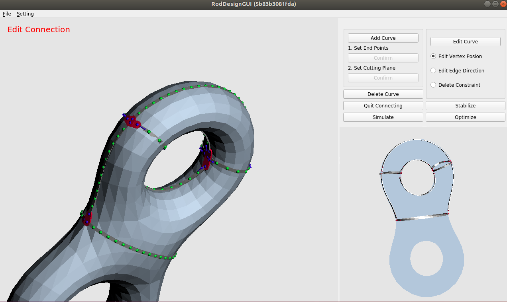

# Rod Design  

## Overview
This is an implementation of a curve design tool [1] and a 3D rod simulation method [2] [3].  



It was going to be a part of my reseach project.

## Build
### Dependency
This software depends on Eigen3, OpenGL and Qt5.  
Please see the detail in Dockerfile.

###  Docker Build
Execute the following command to start a docker container.
```
sh docker_build.sh
sh docker_run.sh
```
Build CMake project on the docker container.
```
cd /work
sh RodDesign/build.sh
```


I checked these commands only on Ubuntu + Nvidia GPU (nvidia-docker) environment.


## Usage
### Menu 
* **Open**: Open mesh files (.obj file)
* **Load**: Load curve network files (.cn file)
* **Export**: Export curve data or rod data (.cn and .rn file)
* **Setting**: Edit material parameter of rods

### Graphical Window
* **Right Mouse Button**: Rotation
* **Shift + Left Mouse Button**: Translation
* **Ctrl + Left Mouse Button**: Zoom

### Edit Tools
* **Add Curve**: Add new curves on mesh surfaces by setting end points and then specifying cutting planes.
* **Delete Curve**: Delete the clicked curves
* **Edit Curve**: Edit curves by specifying curve's node position, by specifying edge directions or by deleting constraints. 
* **Edit Connection**: Add connection between curves by specifying two end points of the curves.
* **Simulate**: Simulate rod dynamics by initializing rods from curve networks and then releasing constraints that embed rods on the surface.  
* **Stabilize**: Not Implemented. 
* **Optimize**: Not Implemented.  

These tools are toggled. 

Stabilization tool and optimization tool were main topics of my research but these were not finished.

## Method Overview  

### Curve Design Tool  
The curve design method is proposed in [1].

#### Overview
* Using [1]'s tool, novice users can design curves on descrete surfaces that can be realized as 3D printed objects.  
* The above feature is realized by the fact that curves on surfaces are modeled in a physically plausible way.
* The curves are expressed as piece-wise linear curves and an elastic curve energy is defined based on the formulation of [2] [3].
* The curve model can be viewed as embedding of 3D rod model [2] [3] on 2-manifold surface.
* Loop subdivion scheme [4] is adopted in order to transform input descrete meshes into smooth manifolds. 
  This transformation allow us to continuously optimize curve nodes' position such that elastic curve energy is minimized.


### 3D Rod Simulation  
The 3D rod simulation is implementation of the model proposed in [2] [3].

#### Overview
* General simulation methods such as FEM are not suitable to simulation of thin rod's dynamics.
   Simplified and approximated rod model is preferable in terms of accuracy and computational cost.
* Their rod model is based on Kirchhoff theory of elastic rods and they formulate discrete version of it in DDG (discrete differential geometry) framework.
* Rods are discretized and expressed as sequence of nodes and edges between the nodes. Material frames (triplet of orthonormal vectors) are defined on each edges.
* Bending energy and twist energy is defined using cuvature of the curve and rotation of material frames respectively.
* [3] improve computational efficiency of [2] and make it practical for real-time implicit time integration, which requires several linear system solve for each time instance.
* This improvement is achieved by careful choice of reference frames that avoid long-term dependency of variables.

## References 

[1] Zehnder, Jonas, Stelian Coros, and Bernhard Thomaszewski. "Designing structurally-sound ornamental curve networks." ACM Transactions on Graphics (TOG) 35.4 (2016): 1-10.  
[2] Bergou, Miklós, et al. "Discrete elastic rods." ACM SIGGRAPH 2008 papers. 2008. 1-12.  
[3] Bergou, Miklós, et al. "Discrete viscous threads." ACM Transactions on graphics (TOG) 29.4 (2010): 1-10.  
[4] Stam, Jos. "Evaluation of loop subdivision surfaces." SIGGRAPH’98 CDROM Proceedings. 1998.  
